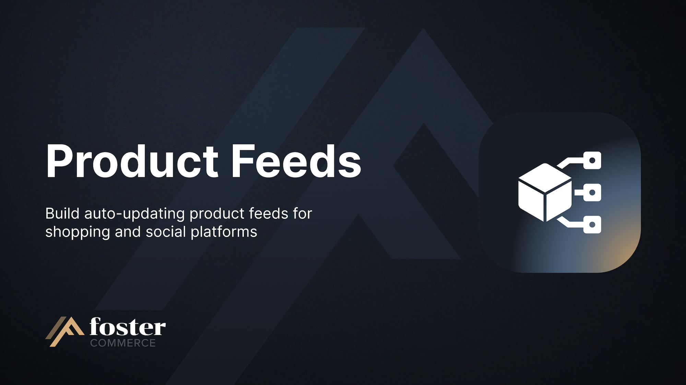

# Product Feeds

Build auto-updating **product feeds** for shopping and social platforms from Craft Commerce variants or Craft entries.

## What it does

- Supports Google, Klaviyo, Meta, Microsoft, Pinterest, and TikTok, one feed per platform.
- Serves each feed from a stable URL. You paste it into the platform once, and the platform fetches it on a schedule.
- Builds from your Commerce variants, taking SKU, price, and stock availability straight from Commerce, or from your Craft entries when the thing you advertise is a page rather than a product.
- Rebuilds a feed when someone edits a product in it, so a price change is live at the feed URL without waiting for the next scheduled build.
- Lists the products the last build left out and why, downloadable as a CSV.
- Previews the items a feed would contain, and checks your first image against the platform's size minimum.
- Narrows a feed to part of your catalog, so one product type can drive several feeds (one per brand, one for everything on promotion).

## Requirements

- Craft CMS `^5.2.0`
- Craft Commerce `^5.5.0`
- PHP `^8.2` with the `json`, `zlib`, and `xmlwriter` extensions

## Install

```sh
composer require fostercommerce/product-feeds
./craft plugin/install product-feeds
```

Then choose a filesystem under **Settings -> Plugins -> Product Feeds**, and schedule the build command.

See [`docs/installation.md`](./docs/installation.md) for the full guide.

## Platforms

A feed's platform decides which attributes it carries, how they are worded, and how large its images have to be. Google and Microsoft accept an item with no brand, GTIN, or MPN, and say so in the feed; Meta and TikTok require a brand.

The five shopping platforms take the same RSS document. Klaviyo takes a JSON catalog instead, carrying stock as a number rather than an availability string, and is added in Klaviyo as a Catalog Source.

See [attributes](./docs/reference/attributes.md) for what each platform sends and where each value comes from.

## Mapping

Every attribute a platform defines gets a row, and you say where its value comes from: a native value such as the product title or URL, a Craft field, or the same default on every item. A variant feed takes its Commerce attributes from Commerce and does not ask you for them. Each attribute offers only the field types that can feed it, so `image_link` takes an Assets field and `price` takes a Number field.

You can narrow a feed with Craft's condition builder, the one you already use on an element index.

See [mapping a feed](./docs/user-guide/mapping.md).

## Images

Each feed carries its own image engine and size, so a Pinterest feed can carry the portrait image it demands while a Google feed carries a square one from the same asset field. Craft transforms, Imager X, and Small Pics are all supported, and each appears once its plugin is installed.

See [images](./docs/user-guide/mapping.md#images).

## Permissions

- `productFeeds:view`: see feeds, their mapping, their data issues, and the feed URL.
- `productFeeds:edit`: create, edit, duplicate, reorder, and delete feeds, and rotate a feed's URL.
- `productFeeds:build`: build a feed now, preview one, and test an image.

See [permissions](./docs/reference/permissions.md).

## Documentation

See [`docs/`](./docs/index.md).

## License

Proprietary. See [LICENSE.md](./LICENSE.md).
