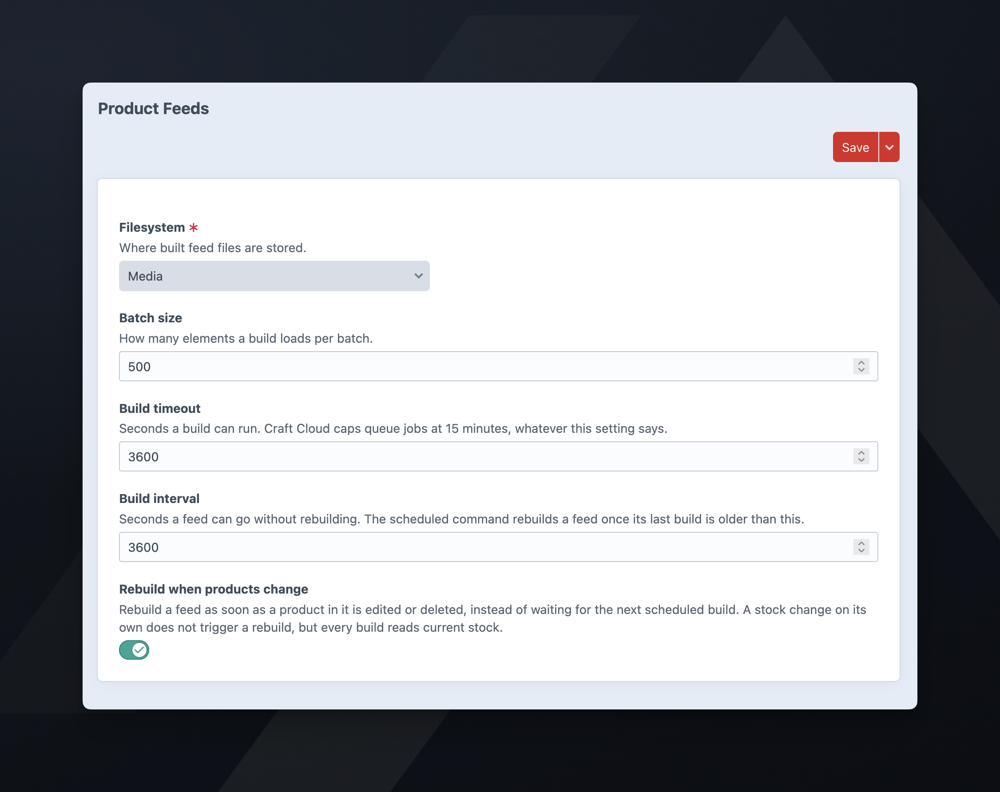

# Installation

Build auto-updating **product feeds** for shopping and social platforms from Craft Commerce variants, Craft entries, or custom sources.

## Requirements

- Craft CMS `^5.9.0`
- Craft Commerce `^5.5.0`
- PHP `^8.2` with the `json`, `zlib`, and `xmlwriter` extensions

## Install

```sh
composer require fostercommerce/product-feeds
./craft plugin/install product-feeds
```

## Configure

**Settings -> Plugins -> Product Feeds.**



- **Filesystem**: where built feed files are stored. Required, no default. The plugin writes feeds to a `product-feeds/` directory inside it. Craft serves the feed from its own URL, so the filesystem doesn't need public URLs. To see why a public filesystem is a risk, see [troubleshooting](./user-guide/troubleshooting.md#the-filesystem-url-serves-the-feed-without-the-token). A local folder works only where the queue worker and the web server share a disk.
- **Batch size**: how many elements a build loads per batch. Default: `500`.
- **Build timeout**: seconds a build can run. Default: `3600`. Sets the queue job's time to run (TTR). A build still unfinished after this long counts as stalled, and the next `feeds/build` queues it again. Craft Cloud caps queue jobs at 15 minutes, whatever this setting says.
- **Build interval**: seconds a feed can go without rebuilding. Default: `3600`. The scheduled command rebuilds a feed once its last build is older than the interval.
- **Rebuild when products change**: rebuilds a feed as soon as a product or entry in it is edited or deleted, without waiting for the next scheduled build. Editing several products in a row rebuilds the feed once. On by default. A stock change does not trigger a rebuild; see [building on a schedule](#building-on-a-schedule).

Any of these can be set per environment in `config/product-feeds.php`, keyed by the property name: `fsHandle`, `batchSize`, `buildTimeout`, `buildInterval`, and `rebuildOnChange`.

## Console commands

```sh
./craft product-feeds/feeds/build                 # queue every enabled feed that is due
./craft product-feeds/feeds/build --all           # queue every enabled feed, due or not
./craft product-feeds/feeds/build --feed=main     # queue every feed with that handle, enabled or not
./craft product-feeds/feeds/build --all --inline  # build in this process instead of queueing
```

Handles are unique per site, so on a multi-site store `--feed` builds that handle's feed on every site. Without `--feed`, the command queues only enabled feeds.

`--inline` skips the queue and builds in the console process. A failed build writes its message to stderr and exits non-zero.

## Building on a schedule

Schedule `./craft product-feeds/feeds/build` with your host's scheduler. Without options, the command queues only feeds whose last build is older than the build interval, so you can run the command more often than the interval.

A crontab entry that checks every 15 minutes:

```sh
*/15 * * * * /path/to/craft product-feeds/feeds/build
```

Keep the schedule even with **Rebuild when products change** on. That setting responds only to a product or entry being edited or deleted. A stock change does not edit the product, so the rebuild does not run; the next build recomputes `availability`.

## Queue

Unless your host runs the queue for you, run a supervised worker. By default Craft runs queue jobs during control panel requests, so a large build can hold up a page load. For the options, see [Craft's queue documentation](https://craftcms.com/docs/5.x/system/queue.html).

```sh
./craft queue/listen
```

## Site URL

A feed's `link` attribute is the product or entry URL, and it must be absolute. Make sure the site's base URL is absolute in the environment the queue runs in, not only in the web environment.

## Checking the feed URL

After every successful build the plugin sends a `HEAD` request to the feed URL and shows the result under **Feed URL** on the feed's **Settings** tab. A failed build does not run the check.

The check is advisory and does not fail a build. The check fails when the queue worker cannot resolve the site's public hostname, or when basic auth or a WAF blocks the request.

If the check reports a failure, see [troubleshooting](./user-guide/troubleshooting.md).
