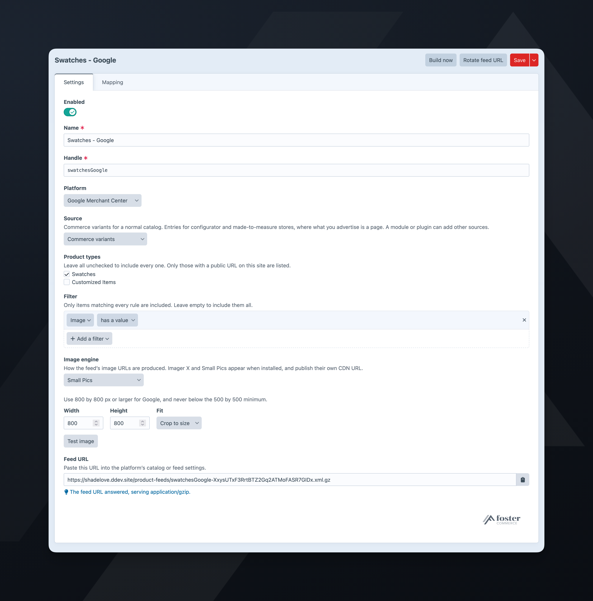
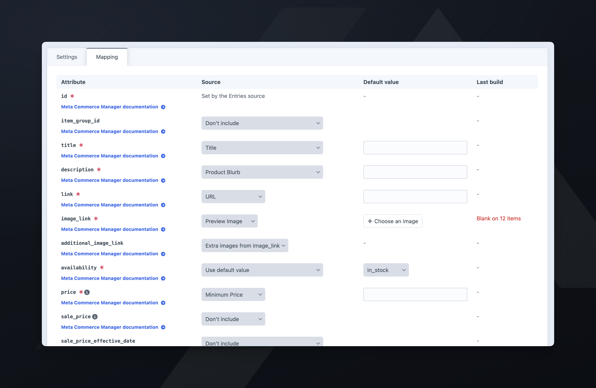
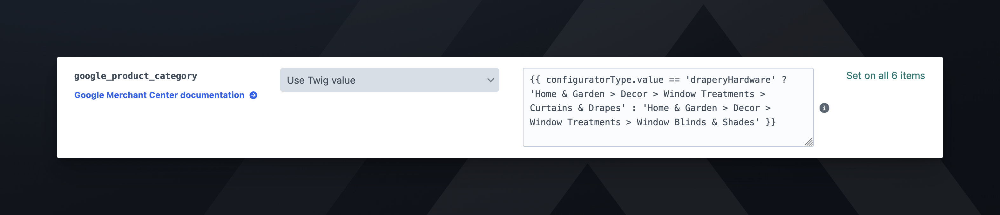
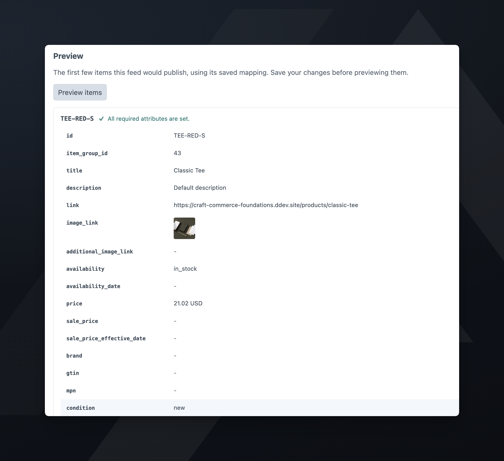
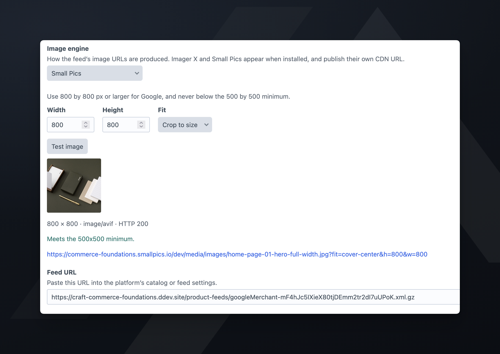

# Mapping a feed

How to connect Craft data to a platform's attributes.

## Choosing what the feed reads

On the **Settings** tab, a variant feed lists your **Product types** and an entry feed lists your **Entry types**, grouped by section. Leave every box unchecked to include every type with a public URL on this site.

An entry type used by two sections is listed under each. Selecting "General Page" under **Pages** includes only the Pages entries of that type.

Singles are not listed, and neither is a type without a public URL on this site.

A feed on a custom source, one a module or plugin adds to the **Source** menu, shows neither list and no **Filter**. The source's code selects the elements.

What you select here determines which fields the **Mapping** tab offers.

## The Mapping tab

Every attribute the platform defines gets a row on the **Mapping** tab. A row the plugin or the source sets shows who sets it, such as "Set by the Commerce variants source", in place of a dropdown. Every other row has a dropdown for where its value comes from:

- **Don’t include**: the attribute is left out. A required attribute has no **Don’t include**; its row starts blank until you choose where its value comes from.
- **Use default value**: the same value for every item, set in the **Default value** column. Use it for `condition`, and for `brand` on a single-brand store. On `image_link` it is an asset picker rather than a text box.
- **Use Twig value**: a Twig template, written in the **Default value** column and rendered for each item. See [Twig values](#twig-values).
- **Variant properties** / **Product properties**, or **Entry properties** on an entry feed: a native value such as the SKU, the product title, or the product URL.
- **Variant fields** and **Product fields**, or **Entry fields**: a Craft field. On a variant feed the variant's own fields and its product's fields are listed separately.

On a custom source's feed, the dropdown lists **Properties** (title, URL, slug, and ID) and **Fields**.

The **Default value** box appears with **Use default value**, and with a property or field. With a property or field, the default applies to an item whose value is blank.

Each attribute offers a fixed set of field types, and only those types appear in its dropdown:

| Attribute | Field types |
|---|---|
| Text attributes, such as `title` and `description` | Plain Text, Number, Dropdown, Radio Buttons, Checkboxes, Lightswitch, Email, Categories, CKEditor |
| `link` | Plain Text |
| `image_link`, `additional_image_link` | Assets |
| `price`, `sale_price` | Number, Plain Text |
| `product_type` | Categories, Plain Text |

Matrix, Table, Date, Link, Money, Entries, Tags, Users, and Color fields are not offered.

On an entry feed, only fields on the entry types you selected are listed.

The dropdowns list fields from the source, platform, and types the feed was last saved with. Save a new feed before mapping it. After you change the source, platform, or types, the table stays hidden until you save again. Saving the feed with a different source replaces the mapping with that source's defaults.

Fields are listed under the name their field layout gives them, not the field's global name. One field reused under two handles, such as `previewImage` and `seoImage`, appears twice.

## Required attributes

Every shopping platform requires `id`, `title`, `description`, `link`, `image_link`, `availability`, and `price`, and Meta and TikTok also require `brand` and `condition`. A feed does not build until its required attributes are mapped or derived. For the full list per platform, see [attributes](../reference/attributes.md).

A **Klaviyo feed** has no `availability`: it sends stock as the number `inventory_quantity`, and `inventory_policy` sets what Klaviyo does with an item at zero stock.

On a **variant feed** the plugin derives `id`, `item_group_id`, `price`, `sale_price`, `sale_price_effective_date`, `availability`, and `inventory_quantity` from Commerce, and `identifier_exists` as well on Google and Microsoft. That leaves `title`, `description`, `link`, and `image_link` to map, plus `brand` and `condition` on a Meta or TikTok feed.

On an **entry feed** there is no Commerce variant behind the item, so `price` and `availability` are yours to map, and are required. You can also map `item_group_id`, `sale_price`, and `sale_price_effective_date`; a Twig value can build a date range from Date fields.

A new variant or entry feed is saved partly mapped: `title` and `link` use the product's or entry's title and URL, and `condition` defaults to `new`. A new entry feed also sets `availability` to `in_stock`. A feed on a custom source starts unmapped.

## Twig values

**Use Twig value** renders a Craft [object template](https://craftcms.com/docs/5.x/system/object-templates.html) for each item, such as `{{ title }} in {{ color }}`. Use it when a field holds the right data in the wrong shape for an attribute, so the feed can keep its built-in source and platform.

| Variable | Holds |
|---|---|
| `object` | The variant, the entry, or a custom source's element. Its properties and fields are also variables of their own, such as `title`, `sku`, or `product` |
| `item` | On a custom source's feed, the values the source supplied for this item, such as `item.id` and `item.size` |
| Source variables | On a custom source's feed, any variables the source passes for the item |

The info icon beside each Twig value lists the variables its feed's source offers.

The plugin cleans up the output the same way as a mapped value: it strips markup and cuts text to the attribute's limit. For an image attribute, the template must output an image URL.

If a template fails for an item, the plugin leaves that item's attribute blank, logs the first error for each attribute, and continues. An item missing a required attribute is excluded. The **Last build** column shows how many items failed and the first error. The plugin does not check a template when you save, and **Preview items** shows the attribute blank without the error.

### Twig and the sandbox

A Twig value has the same access as any other template on the site. Anyone who can edit feeds can read the site's configuration, such as `{{ craft.app.config.db.password }}`, and publish it in a public feed. Grant `productFeeds:edit` only to people you trust with the site's configuration.

When the site turns on Craft's `enableTwigSandbox` setting, templates run in Craft's sandbox instead. The sandbox blocks the configuration example above, and also blocks Commerce properties read through `object`, such as `{{ object.sku }}` and `{{ object.product.title }}`. Write `{{ sku }}` and `{{ product.title }}` instead. Both forms work with the sandbox on or off.

## Filtering a feed

The **Filter** on the **Settings** tab is Craft's condition builder. Add rules to limit the feed to part of its source. One product type can then supply several feeds, such as one per brand or one for items on promotion.

## Previewing

Once a feed is saved, **Preview items** on the **Mapping** tab shows the first few items as the feed would publish them. It also lists the items the build would exclude, and why.

The preview reads the feed's saved mapping, not the one on screen. Save your changes before previewing.

## Last build column

After a build, the **Last build** column reports how each mapped row did:

| Cell | Meaning |
| --- | --- |
| `Set on all 12,483 items` | Every item in the feed had a value. |
| `Blank on 4,201 items` | You mapped the attribute, and it was blank on that many items. |
| `Twig error, blank on 3 items` | The Twig value failed on that many items. The first error is shown beneath. |
| `17 items priced at zero or less` | `price` and `sale_price` only. The items stay in the feed. |
| `Discarded a value that isn’t an absolute URL on 5 items.` | A link held a value that isn't an absolute `http` or `https` URL. The first one is shown beneath. |
| `Discarded an image URL the site couldn’t resolve on 2 items. Check the site’s base URL.` | An image URL was relative and the site's base URL isn't absolute, or the URL isn't `http` or `https`. The first one is shown beneath. |
| `-` | Not mapped, or the feed has never built. |

Attributes set to **Don’t include** are not counted.

## Excluded items

An item is excluded when a required attribute is blank, or when an earlier item has the same `id`. The **Excluded items** panel lists up to 50 of the items the last build excluded, each with its reason and a link to the element. When the list is longer, **Download full list (CSV)** has the rest.

The feeds index shows the same count in its **Issues** column.

## Items with no identifiers

When `brand`, `gtin`, and `mpn` are all blank on an item, a Google or Microsoft feed sends `identifier_exists: no`.

Meta, Pinterest, and TikTok have no such field. Meta and TikTok require a brand; a Pinterest item with no identifiers is sent without them.

## Images

Map one Assets field to `image_link`. The first asset becomes the image, and up to 10 more become `additional_image_link`. A field holding a single image and a field holding many behave the same way.

Microsoft has no `additional_image_link`, so a Microsoft feed sends only the first image.

To use a fallback image on items whose image field is empty, set `image_link` to **Use default value** and pick an asset. The fallback uses the same image engine and transform as a mapped image.

To send a different field's images as extras, map `additional_image_link` to its own Assets field. The feed then uses that field's first 10 assets in place of **Extra images from image_link**.

An asset with no public URL does not produce an image, and the plugin excludes the item.

The plugin percent-encodes image and product URLs.

### Image engine

**Image engine** sets the URL the feed sends for `image_link`:

- **None (the asset’s own URL)**: the URL the asset's filesystem gives it, with no transform.
- **Craft**: Craft generates a transform, and the feed sends its URL.
- **Imager X** or **Small Pics**: that plugin processes the asset, and the feed sends its CDN URL. Each appears only when the plugin is installed.

With the Craft engine, pick a transform under **Craft transform**, or pick **Custom size** and set the width, height, and fit. Either dimension on its own is a valid transform.

**Test image** resolves `image_link` for the first item in the feed and fetches the result. It uses the image settings on screen, and the mapping on screen; for a user who can't edit feeds, it uses the saved mapping. You see the URL, a thumbnail, and whether it is a reachable image, before running a build. **Test image** appears on a saved feed whose image engine is not **None (the asset’s own URL)**.

The test reports the image against the platform's minimum: 500 by 500 for Google, Meta, and TikTok, and 1000 by 1500 for Pinterest. Microsoft documents no minimum. The check compares only width and height. A landscape 2000 by 1500 image passes Pinterest's check but is the wrong shape for Pinterest.

Map `image_link` before you click **Test image**.

## Prices

Prices come from Commerce, in the currency of the site's Commerce store, and are the price a logged-out shopper sees. The feed does not include catalog pricing scoped to a customer group.

On an entry feed, map `price` to a Number field. The plugin formats the value in the store's currency, so `199` appears in the feed as `199.00 USD`. A field holding text such as "from 199" has no usable price, and the item is excluded.

`sale_price` appears only when a promotional price is lower than the price. Stores using the Sales system also get `sale_price_effective_date`. Stores on Catalog Pricing Rules do not, because Commerce does not keep each rule's dates when it resolves a variant's price.

If items come back priced at zero, see [troubleshooting](./troubleshooting.md).
