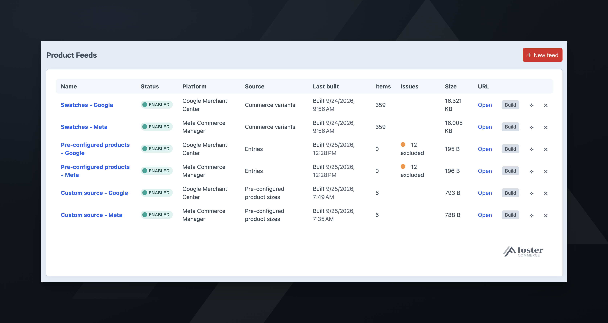

# Troubleshooting

Why a feed failed, or has fewer items than expected.

## The build failed

The feeds index shows the failure and its reason in the feed's **Last built** column. The **Status** column reports whether the feed is enabled, not how its last build went.

These failures are permanent, and the queue does not retry them:

- **No filesystem is configured.** Choose one in the plugin's settings.
- **The configured filesystem no longer exists.** The filesystem was deleted or renamed. Choose another in the plugin's settings.
- **The site isn't assigned to a Commerce store.** A feed takes its currency from the store. Assign the site to a store under **Commerce -> Settings -> Sites**.
- **The feed's source is no longer provided.** The module or plugin that registered the source was removed. Reinstall it, or pick another source on the feed's **Settings** tab.
- **The image engine's plugin is no longer installed.** Choose another image engine on the feed's **Settings** tab.
- **Required attributes aren't mapped.** The message names them.
- **The product types or entry types you selected have no public URL.** The message names them.
- **No product type or section this feed reads has a public URL.** Give at least one product type or section the feed reads a URI format on this site.

The queue retries every other failure twice.

## The feed built, but items are missing

The **Excluded items** panel on the feed's **Mapping** tab lists the missing items, with a CSV download for the full set. An item is excluded when a required attribute was blank for that item, most often:

- `link`: the product or entry has no URL, or the URL is relative. Check that the site's base URL is absolute in the environment the queue runs in.
- `image_link`: no asset, or the asset's filesystem has no public URLs.
- `description`: the field is empty on that item.

A Meta or TikTok feed also excludes items with no `brand` or `condition`. Google, Microsoft, and Pinterest treat both as optional.

An item is also excluded when an earlier item in the feed had the same `id`. It is listed as "duplicate id".

## Pinterest rejects the images

Pinterest requires a portrait image, at least 1000 by 1500. A square transform that meets Google's 500 by 500 minimum is below Pinterest's.

Each feed has its own image engine and size. Set the Pinterest feed to a 2:3 size, and use **Test image** to confirm before building.

## The filesystem URL serves the feed without the token

Craft serves the feed at `https://your-site/product-feeds/<handle>-<token>.xml.gz`, not from the filesystem's own URL.

Point the plugin at a filesystem with no public URLs. The token in the feed URL is the only credential on the feed route. A public filesystem serves the same files without it: the built feed, and the excluded items CSV with your SKUs, product titles, and control panel edit URLs. Use a filesystem dedicated to feeds.

The **Feed URL** notice on the feed's **Settings** tab reports whether the URL answered after the last build, and with what content type.

## The platform says the feed is empty or truncated

Feeds are served gzipped. If a proxy or WAF in front of Craft compresses the response again, the platform cannot decompress the feed. Serve `.xml.gz` without a `Content-Encoding` header, or use the `.xml` URL, which serves the same feed uncompressed.

If staging uses server-level basic auth, the platform cannot fetch the feed. The build still succeeds, and the **Feed URL** notice on the feed's **Settings** tab reports the failed check.

## Every item is disapproved for missing shipping

The feed does not send per-item shipping or tax. Set them in your account on the platform.

## Items are priced at zero

The **Mapping** tab shows a count under `price` after each build. The feed sends those items with a price of `0.00`.

A zero price means the mapped field holds `0`, or on a variant feed, that the variant's price in Commerce is `0`. An empty price field does not send `0.00`; the item is excluded instead.

## The platform rejects the price

The feed sends the price a logged-out shopper sees. If the landing page shows a different price, the platform disapproves the item for a price mismatch. On a made-to-measure store, the platform still counts a mismatch when the customer pays a different amount from the starting price on the page and in the feed.

## The feed is stale

Feeds rebuild when the scheduled command finds them older than the build interval, and when someone edits a product or entry they contain. If neither is happening, check that `./craft product-feeds/feeds/build` is scheduled on this host. To schedule it, see [installation](../installation.md#building-on-a-schedule).

A stock change does not trigger **Rebuild when products change**; see [building on a schedule](../installation.md#building-on-a-schedule).

## The feed URL stopped working

**Rotate feed URL** generates a new URL and moves the built feed to it, so the new URL serves the current feed immediately. The old URL stops working when the feed saves with the new URL. Paste the new URL into the platform.
